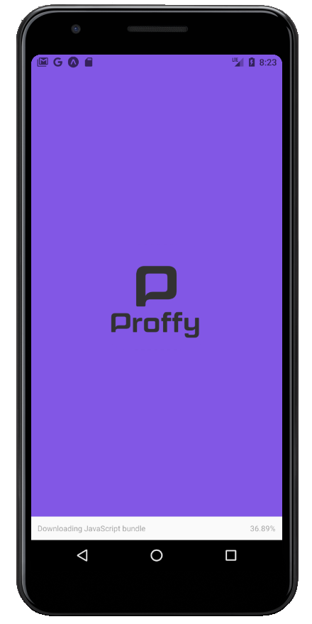

<h1 align="center">Proffy</h1>

 
   

 

<h2>📖 About</h2>

Proffy is an online study platform that connects students to teachers to streamline learning.

------------
<h2>🔖 Layout</h2>

Check the layout on <a href="https://www.figma.com/file/GHGS126t7WYjnPZdRKChJF/Proffy-Web">Figma</a>.

------------

<h2>📚 Documentation</h2>

Under construction.

------------

<h2>🚀 Tecnologies</h2>

This project was developed with:
- [NodeJs](https://nodejs.org/en/ "NodeJs")
- [Express](https://expressjs.com/ "Express")
- [Expo-Cli](https://expo.io/tools#cli "Expo-Cli")
- [React](https://reactjs.org/ "React")
- [React Native](https://reactnative.dev/ "React Native")
- [Typescript](https://www.typescriptlang.org/ "Typescript")

------------

<h3>Dependencies</h3>

- [Express](https://expressjs.com/ "Express")
- [KnexJS](http://knexjs.org/ "KnexJS")
- [SQLite3](https://www.npmjs.com/package/sqlite3 "SQLite3")
- [Axios](https://www.npmjs.com/package/axios "Axios")
- [Expo Google Fonts](https://github.com/expo/google-fonts " [Expo Google Fonts]")

------------

<h2>♻️ How to Contribute</h2>

- Fork this repository;

- Make a branch with your feature: `git checkout -b my-feature`

- Commit your changes: `git commit -m 'feat: My new feature'`

- Push your branch: `git push origin my-feature`

------------

<h2>🎓 Quem ministrou?</h2>
The Next Level Week 2.0 was taught by <a href="https://github.com/diego3g">Diego Fernandes</a> from <a href="https://rocketseat.com.br/">Rocketseat</a>

------------

<h2>📃License</h2>

This project is under MIT License. Access <a href="https://github.com/Nandosbx/Ecoleta/blob/master/LICENSE.md">License</a> and learn more.

------------

<footer align="center">
 <strong align="center">Made with 💜 by Fernando Batista</strong>
</footer>