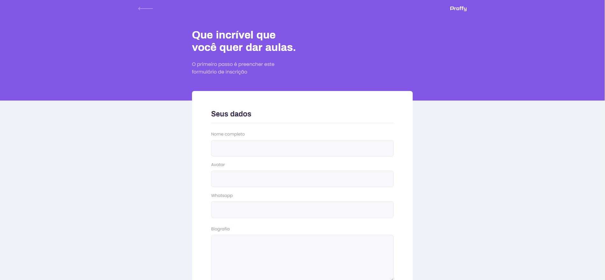
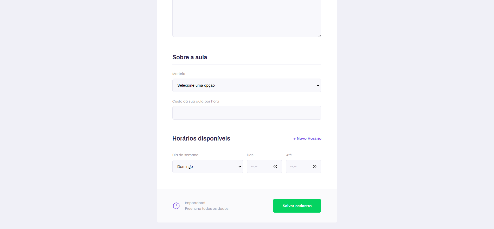

<h1 align="center">FRONTEND</h1>

<h2>	📷  WEB</h2>

------------
<h2>🔖 Layout</h2>

💻 Check the Web layout on <a href="https://www.figma.com/file/GHGS126t7WYjnPZdRKChJF/Proffy-Web">Figma</a>.

------------

<h2>📚 Documentation</h2>

🚧Under construction🚧.
Access <a href="https://github.com/Nandosbx/proffy/blob/master/DOCUMENTATION.md">Documentation</a> and learn more.

------------

<footer align="center">
 <strong align="center">Made with 💜 by Fernando Batista</strong>
</footer>
